# Edu Vault

**Uçtan Uca Şifreli Masaüstü Parola Yöneticisi (Zero-Knowledge Architecture & Key Wrapping)**

<p align="center">
  <a href="./README.md"></a>
  <a href="./README_EN.md"></a>
</p>

<p align="center">
  
  
  
  
  
  
</p>

Edu Vault, yüksek güvenlik hassasiyetine sahip bireysel kullanıcılar ve kurumlar için Java kullanılarak geliştirilmiş, Sıfır Bilgi (*Zero-Knowledge Architecture*) ve Anahtar Sarma (*Key Wrapping*) mimarisine dayanan, askeri ve finansal standartlarda (*Bank-Grade*) uçtan uca şifreli masaüstü parola yönetimi yazılımıdır.

Edu Vault mimarisinde kullanıcının Master Password'ü veya şifrelenmemiş kasa verileri veritabanına, disk üzerine veya sunucuya asla düz metin (*plaintext*) olarak kaydedilmez. Sistem, modern blokzincir (Bitcoin/Ethereum) donanım cüzdanlarında kullanılan 24 Kelimelik BIP39 Seed Phrase standardını parola yönetimi disiplinine entegre ederek tam veri gizliliği ve kayıpsız veri kurtarma garantisi sağlar.

---

## İçindekiler

- [Proje Hakkında](#proje-hakkında)
- [Hedef Kitle ve Sektör Karşılaştırması](#hedef-kitle-ve-sektör-karşılaştırması)
- [Kriptografik Güvenlik Mimarisi ve Teknolojik Üstünlükler](#kriptografik-güvenlik-mimarisi-ve-teknolojik-üstünlükler)
- [Arka Planda Çalışan 10 Katmanlı Güvenlik Mekanizması](#arka-planda-çalışan-10-katmanlı-güvenlik-mekanizması)
- [Brute Force Engelleme ve Kademeli Kilitleme Mimarisi](#brute-force-engelleme-ve-kademeli-kilitleme-mimarisi)
- [Tüm Özellikler ve Modüller](#tüm-özellikler-ve-modüller)
- [Ekran Görüntüleri](#ekran-görüntüleri)
- [Veritabanı Örnekleri](#veritabanı-örnekleri)
- [Teknoloji Yığını ve Kullanım Gerekçeleri](#teknoloji-yığını-ve-kullanım-gerekçeleri)
- [Yazılım Mimari Yapısı](#yazılım-mimari-yapısı)
- [Veritabanı Yapısı ve İlişkisel Şema](#veritabanı-yapısı-ve-ilişkisel-şema)
- [Kurulum ve Çalıştırma Rehberi](#kurulum-ve-çalıştırma-rehberi)
- [Proje Yapısı ve Dosya Ağacı](#proje-yapısı-ve-dosya-ağacı)
- [Sürüm Geçmişi](#sürüm-geçmişi)
- [Lisans ve Geliştirici Bilgileri](#lisans-ve-geliştirici-bilgileri)

---

## Proje Hakkında

Edu Vault, kullanıcıların yüzlerce farklı dijital platforma ait kullanıcı adı, parola, web adresi ve özel notlarını tek bir güvenli kasada toplamalarını sağlayan bir masaüstü uygulamasıdır.

Klasik parola yöneticilerinin aksine Edu Vault v2.0 ile birlikte **Key Wrapping (Anahtar Sarma)** mimarisine geçilmiştir. Bu mimaride kullanıcının Master Password'ü kasa verilerini doğrudan şifrelemek için kullanılmaz. Sistem şu adımlarla çalışır:

1. Kullanıcı kaydolduğunda `SecureRandom` kullanılarak 256-bit boyutunda bağımsız ve yüksek entropili bir **Vault Key** üretilir.
2. Kasadaki tüm parola kayıtları bu Vault Key ile şifrelenir.
3. Vault Key'in kendisi ise hem kullanıcının Master Password'ünden türetilen **Master Wrap Key** hem de BIP39 kurtarma ifadesinden türetilen **Recovery Wrap Key** ile çift katmanlı olarak sarılarak veritabanına yazılır.

Bu yapı sayesinde Master Password değiştirildiğinde kasadaki tüm şifrelerin yeniden şifrelenmesine gerek kalmaz; yalnızca Vault Key'i saran dış anahtar güncellenir (*Re-Wrapping*). Bu mekanizma hem işlem performansını $O(1)$ seviyesine indirir hem de anahtarlar arası kriptografik izolasyon sağlar.

---

## Hedef Kitle ve Sektör Karşılaştırması

| Kullanıcı Segmenti | Karşılaşılan Problem | Edu Vault Çözümü |
|--------------------|----------------------|------------------|
| **Bireysel Kullanıcılar** | Karmaşık şifreleri unutma ve güvensiz yöntemlerle saklama | Tüm verileri uçtan uca şifreli yerel kasada toplama |
| **Geliştiriciler ve Sistem Yöneticileri** | 3. taraf bulut sunucularına veri güvenliği nedeniyle güvenememe | Kendi veritabanını kontrol ettiği yerel bellek korumalı mimari |
| **Güvenlik Uzmanları** | Ana şifre unutulduğunda verilerin yok olması veya arka kapı açıklarının varlığı | 24 kelimelik BIP39 Seed Phrase ile veriler kaybolmadan ana şifre sıfırlama |

---

## Kriptografik Güvenlik Mimarisi ve Teknolojik Üstünlükler

Edu Vault içerisinde tercih edilen algoritmalar ve standartlar, NIST (National Institute of Standards and Technology) ve IETF (Internet Engineering Task Force) tarafından onaylanmış uluslararası güvenlik standartları arasından seçilmiştir.

### 1. AES-256-GCM (Galois/Counter Mode)
- **256-Bit Simetrik Anahtar:** $2^{256}$ olası anahtar kombinasyonu sunar. Bilinen hiçbir süper bilgisayar veya kuantum hesaplama yöntemi ile kaba kuvvet saldırısıyla kırılamaz.
- **AEAD (Authenticated Encryption with Associated Data):** Klasik CBC modunun aksine şifreleme sırasında 128-bitlik bir `Authentication Tag` üretir. Veritabanındaki şifreli veri üzerinde 1 bitlik değişiklik yapılması durumunda bile sistem `AEADBadTagException` hatası vererek şifre çözmeyi reddeder (*Tampering Resistance*).

### 2. PBKDF2 (Password-Based Key Derivation Function 2)
- **PBKDF2WithHmacSHA256 (65.536 İterasyon):** Master Password üzerinden türetilen hash ve wrap anahtarlarında 65.536 tur döngüsel hashleme uygulanır. Bu durum, GPU ve ASIC donanımları ile yapılan kaba kuvvet ve Rainbow Table saldırılarının hesaplama maliyetini aşırı derecede yükseltir.
- **PBKDF2WithHmacSHA512 (2.048 İterasyon):** BIP39 kurtarma kelimelerinden 512-bitlik seed türetiminde kullanılır.

### 3. BIP39 Standardı (Bitcoin Improvement Proposal 0039)
- Blokzincir altyapılarında kullanılan resmi anahtar türetim standardıdır.
- 256-bitlik kriptografik entropi ve 8-bitlik SHA-256 checksum birleştirilerek 24 kelimelik okunabilir insan dili formatına dönüştürülür. Ana şifre unutulduğunda veri kaybı yaşanmadan vault anahtarı kurtarılır.

### 4. Cryptographically Secure Pseudo-Random Number Generator (SecureRandom)
- Deterministik olan standart `java.util.Random` yerine, işletim sisteminin Donanımsal Entropi Havuzunu kullanan `java.security.SecureRandom` sınıfı tercih edilmiştir. Tüm IV, Salt ve Vault Key değerleri bu yolla üretilir.

---

## Arka Planda Çalışan 10 Katmanlı Güvenlik Mekanizması

Edu Vault arka planda tam 10 farklı güvenlik katmanını eşzamanlı olarak yürütür:

```
+---------------------------------------------------------------------------------------+
|                              EDU VAULT 10 KATMANLI GÜVENLİK MİMARİSİ                  |
+---------------------------------------------------------------------------------------+
| Katman 1  : PBKDF2-HMAC-SHA256 Giriş Hashleme (65.536 Tur + 16-byte Salt)             |
| Katman 2  : İzole Master Wrap Key Türetimi (Bağımsız Master Wrap Salt)               |
| Katman 3  : 256-bit SecureRandom Vault Key & AES-256-GCM Key Wrapping                 |
| Katman 4  : 256-bit Entropi + 8-bit SHA-256 Checksum ile 24 Kelime BIP39 Üretimi      |
| Katman 5  : PBKDF2-HMAC-SHA512 ve HMAC-SHA256 Recovery Wrap Key Türetimi              |
| Katman 6  : Dinamik 12-byte IV ve 128-bit AEAD Tag ile Şifreleme (AES-256-GCM)       |
| Katman 7  : Re-Wrapping (Sıfır Yeniden Şifreleme Yükü ile Anahtar Paketleme)          |
| Katman 8  : RAM Sanitization (Arrays.fill ile Bellekte Byte Düzeyinde Sıfırlama)      |
| Katman 9  : Kademeli Brute Force Engelleme ve Zorunlu Seed Dondurma Modu              |
| Katman 10 : PreparedStatement (%100 SQL Injection Koruması) ve Strict Input Regex    |
+---------------------------------------------------------------------------------------+
```

### Katmanların Çalışma İlkeleri

#### Katman 1 — Giriş Kimlik Doğrulama Katmanı
Master Password veritabanına düz metin olarak kaydedilmez. Kullanıcı kaydolurken 16-byte rastgele bir `salt` üretilir. Şifre `PBKDF2WithHmacSHA256` ile 65.536 tur işlenerek elde edilen 256-bitlik hash değeri `users.password_hash` sütununa yazılır.

#### Katman 2 — Master Wrap Key İzolasyon Katmanı
Master Password'den, giriş hash'inde kullanılan salt değerinden bağımsız ikinci bir `master_wrap_salt` ile `Master Wrap Key` türetilir. Bu işlem doğrulama anahtarı ile veri açma anahtarını birbirinden kriptografik olarak izole eder.

#### Katman 3 — Vault Key ve Çift Sarma (Key Wrapping) Katmanı
`SecureRandom` ile 256-bit boyutunda bağımsız bir `Vault Key` üretilir. Kasadaki veriler bu Vault Key ile şifrelenir. Vault Key'in kendisi ise Master Wrap Key kullanılarak `AES-256-GCM` modu ile sarılır (`vault_key_master_encrypted`).

#### Katman 4 — BIP39 24-Kelime Kurtarma ve Checksum Katmanı
256-bit entropi üretilir. Entropinin SHA-256 hash'inin ilk 8 biti checksum olarak sonuna eklenir ($256 + 8 = 264$ bit). 264 bitlik dizi 11-bitlik 24 parçaya bölünür. Her parça resmi 2048 kelimelik BIP39 İngilizce kelime listesindeki dizine karşılık gelir. Kelimeler girildiğinde checksum doğrulanır; hatalı dizilimler reddedilir.

#### Katman 5 — BIP39 Recovery Wrap Key Türetim Katmanı
24 kelimelik ifade `PBKDF2WithHmacSHA512` (2.048 iterasyon) ile 512-bitlik seed'e dönüştürülür. Bu seed sabit `EduVault-Recovery-Wrap` anahtarı ile `HmacSHA256` işleminden geçirilerek 256-bit `Recovery Wrap Key` türetilir. Aynı Vault Key bu anahtar ile de sarılarak `vault_key_recovery_encrypted` sütununda saklanır.

#### Katman 6 — Dinamik IV ve AEAD Bütünlük Katmanı
Kasadaki her bir kayıt için `SecureRandom` ile 12-byte (96-bit) yeni bir IV üretilir. Şifreleme `AES-256-GCM` ile yapılarak 128-bitlik doğrulama etiketi (*Authentication Tag*) oluşturulur.

#### Katman 7 — Re-Wrapping (Sıfır Yeniden Şifreleme Maliyeti) Katmanı
Kullanıcı Master Password'ünü değiştirdiğinde kasadaki yüzlerce kayıt yeniden şifrelenmez. Yalnızca RAM'deki Vault Key, yeni Master Password'den türetilen yeni Master Wrap Key ile yeniden sarılır. İşlem $O(1)$ karmaşıklığında tamamlanır.

#### Katman 8 — Bellek Güvenliği (RAM Sanitization)
Java'da `String` nesneleri değiştirilemez (*immutable*) olduğu için bellekte kalır. Edu Vault, Vault Key'i bellekte `byte[]` dizisi olarak tutar. Oturum kapatıldığında veya 10 dakikalık zaman aşımı dolduğunda:
```java
Arrays.fill(currentVaultKeyBytes, (byte) 0);
currentVaultKeyBytes = null;
```
kodu çalıştırılarak bellek fiziken 0 basılarak sıfırlanır.

#### Katman 9 — Kademeli Brute Force ve Dondurma Katmanı
Başarısız giriş denemeleri `login_attempts` tablosunda takip edilir. 5 hatalı denemede kademeli kilit süreleri uygulanır:
- 1. Kilitlenme: 5 Dakika
- 2. Kilitlenme: 15 Dakika
- 3. Kilitlenme: 40 Dakika
- 4. Kilitlenme: 100 Dakika
- 5 Kilit Döngüsü (25 Hatalı Deneme): Hesap tamamen dondurulur. Erişim ancak 24 Kelimelik BIP39 Seed Phrase ile açılabilir.

#### Katman 10 — PreparedStatement ve Girdi Doğrulama Katmanı
- Tüm veritabanı sorguları parametreli `PreparedStatement` ile yürütülür (%100 SQL Injection koruması).
- Kullanıcı Adı: `^[a-zA-Z0-9_]+$` (En az 7 karakter).
- E-posta: `^[A-Za-z0-9+_.-]+@[A-Za-z0-9.-]+\.[A-Za-z]{2,}$` RFC format doğrulaması.
- Telefon: `^\d+$` (10 veya 11 haneli sayı).
- Parola Güçlülüğü: En az 10 karakter, 1 Büyük Harf, 1 Küçük Harf, 1 Rakam ve 1 Özel Karakter.

---

## Brute Force Engelleme ve Kademeli Kilitleme Mimarisi

```
[Hatalı Giriş Denemesi]
         │
         ▼
 5 Başarısız Deneme ---> 1. Kilitlenme: 5 Dakika Bekleme
         │
 10 Başarısız Deneme ---> 2. Kilitlenme: 15 Dakika Bekleme
         │
 15 Başarısız Deneme ---> 3. Kilitlenme: 40 Dakika Bekleme
         │
 20 Başarısız Deneme ---> 4. Kilitlenme: 100 Dakika Bekleme
         │
 25 Başarısız Deneme (5 Kilit Döngüsü) ---> HESAP DONDURULDU
                                              │
                                              ▼
                               [Yalnızca 24 Kelimelik BIP39]
                               [Seed Phrase ile Kurtarılabilir]
```

---

## Tüm Özellikler ve Modüller

- **Güvenli Üyelik ve Oturum Açma:** Girdi formatı doğrulamaları ve PBKDF2 parola hashleme.
- **Zero-Knowledge Key Wrapping:** Kasa anahtarının (Vault Key) çift katmanlı sarılması.
- **BIP39 Seed Phrase Kurtarma:** 24 kelimelik standart kelime listesi ile kayıpsız ana şifre sıfırlama.
- **Kasa Kaydı CRUD İşlemleri:** Site adı, URL, hesap kullanıcı adı, parola ve not ekleme, listeleme, düzenleme ve silme.
- **AES-256-GCM Şifreleme:** Her kayıt için 12-byte yeni IV ve 128-bit AEAD tag ile şifreleme.
- **Gerçek Zamanlı Arama:** Arama çubuğu üzerinden site adı veya kullanıcı adına göre filtreleme.
- **Güçlü Parola Üretici (Password Generator):**
  - Minimum 8 karakter, dinamik uzunluk ayarı.
  - Büyük Harf (`A-Z`), Küçük Harf (`a-z`), Rakam (`0-9`), Özel Karakter (`!@#$%^&*()-_=+[]{};:,.<>?`) seçenekleri.
  - Her seçili kategoriden en az 1 karakter eklenme garantisi ve `Collections.shuffle` ile tam karıştırma.
- **Göster / Gizle (Show / Hide Password):** Parolaları açık metin veya maskeli gösterme seçeneği.
- **Oturum Zaman Aşımı (10 Dakika Idle Timeout):** `javax.swing.Timer` ile takip edilen otomatik çıkış.
- **RAM Sanitization:** Oturum kapandığında `Arrays.fill` ile bellekten Vault Key byte dizisini sıfırlama.
- **Re-Wrapping Şifre Değiştirme:** Verileri yeniden şifrelemeden ana şifre güncelleme.
- **Kademeli Brute Force Engelleme:** 5 denemede kademeli kilit ve 25 denemede hesabı dondurma.

---

## Ekran Görüntüleri

<table>
  <tr>
    <td align="center"></td>
    <td align="center"></td>
  </tr>
  <tr>
    <td align="center">
      <a href="screenshots/login.png">
        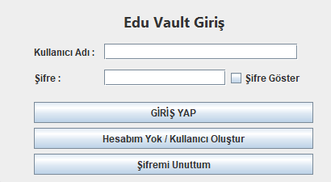
      </a>
    </td>
    <td align="center">
      <a href="screenshots/register.png">
        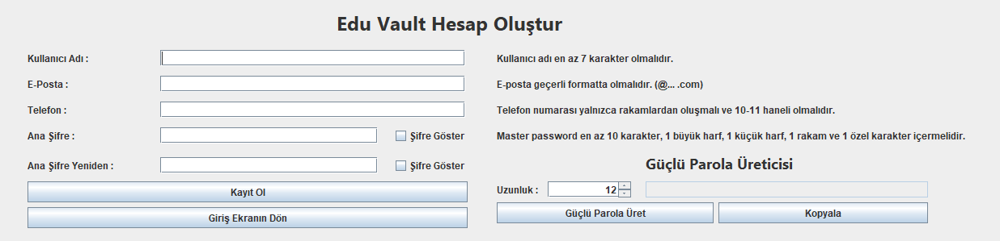
      </a>
    </td>
  </tr>
  <tr>
    <td align="center"></td>
    <td align="center"></td>
  </tr>
  <tr>
    <td align="center">
      <a href="screenshots/recoveryseedphrase.png">
        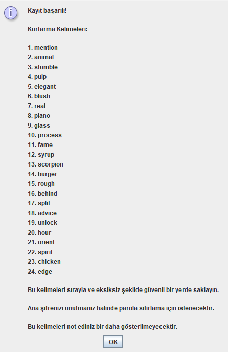
      </a>
    </td>
    <td align="center">
      <a href="screenshots/reset_password.png">
        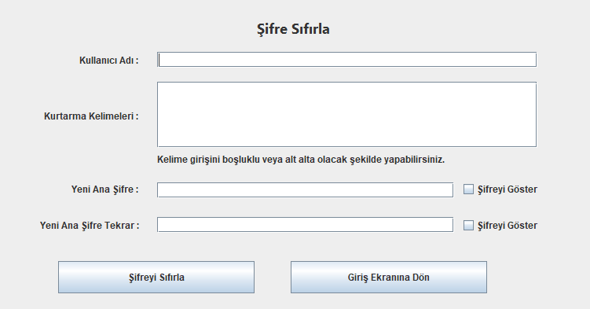
      </a>
    </td>
  </tr>
</table>
<table>
  <tr>
    <td align="center"></td>
    <td align="center"></td>
  </tr>
  <tr>
    <td align="center">
      <a href="screenshots/dashboard.png">
        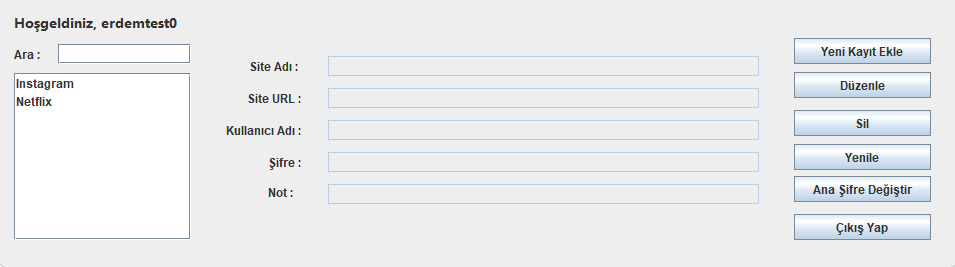
      </a>
    </td>
    <td align="center">
      <a href="screenshots/dashboard2.png">
        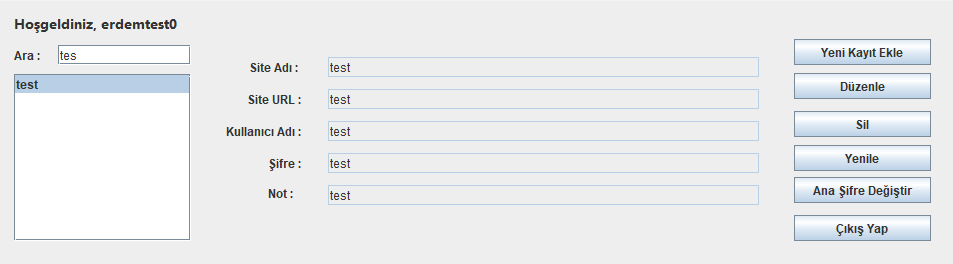
      </a>
    </td>
  </tr>
  <tr>
    <td align="center"></td>
    <td align="center"></td>
  </tr>
  <tr>
    <td align="center">
      <a href="screenshots/add_password.png">
        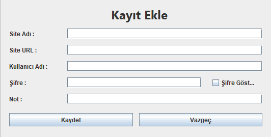
      </a>
    </td>
    <td align="center">
      <a href="screenshots/edit_password.png">
        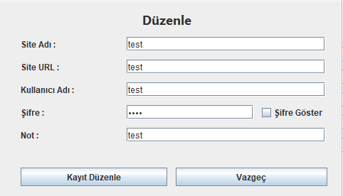
      </a>
    </td>
  </tr>
</table>

<table>
  <tr>
    <td align="center"></td>
    <td align="center"></td>
  </tr>
  <tr>
    <td align="center">
      <a href="screenshots/password_generator.png">
        
      </a>
    </td>
    <td align="center">
      <a href="screenshots/change_master_password.png">
        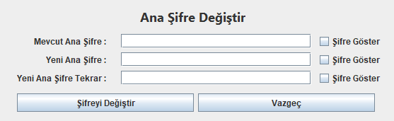
      </a>
    </td>
  </tr>
</table>

---

## Veritabanı Örnekleri

<table>
  <tr>
    <td align="center"></td>
    <td align="center"></td>
  </tr>
  <tr>
    <td align="center">
      <a href="screenshots/database_schema.png">
        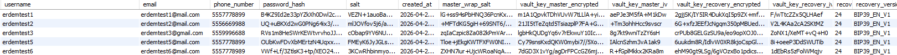
      </a>
    </td>
    <td align="center">
      <a href="screenshots/database_schema2.png">
        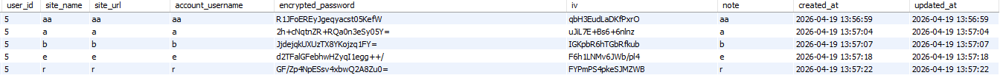
      </a>
    </td>
  </tr>
</table>

---

## Teknoloji Yığını ve Kullanım Gerekçeleri

| Katman | Teknoloji / Kütüphane | Açıklama |
|--------|----------------------|----------|
| **Kullanıcı Arayüzü (GUI)** | Java Swing / AWT | Masaüstü formu ve diyalog yönetimi |
| **Geliştirme Dili** | Java (JDK 17+) | Nesne yönelimli core iş mantığı |
| **Veritabanı** | MySQL 8.0 / JDBC | İlişkisel veritabanı ve güvenli PreparedStatement sorguları |
| **Simetrik Şifreleme** | AES-256-GCM | Authenticated Encryption with Associated Data (AEAD) |
| **Anahtar Türetme (KDF)** | PBKDF2WithHmacSHA256 | Master Hash & Master Wrap Key türetimi (65.536 iterasyon) |
| **Kurtarma Anahtar Türetimi** | PBKDF2WithHmacSHA512 | BIP39 Seed türetimi (2048 iterasyon, 512-bit output) |
| **HMAC Algoritması** | HmacSHA256 | Recovery Wrap Key HMAC türetimi |
| **Kurtarma Standardı** | BIP39 Standardı | 24 Kelimelik İngilizce mnemonic kelime listesi (2048 kelime) |
| **Rastgele Veri Üreteci** | `java.security.SecureRandom` | Kriptografik güvenli IV, Salt ve Vault Key üretimi |
| **Geliştirme Ortamı** | NetBeans IDE | Proje yapısı, GUI Builder ve Ant build araçları |

---

## Yazılım Mimari Yapısı

Edu Vault, katmanlı mimari (*Layered Architecture*) prensiplerine uygun olarak tasarlanmıştır:

```
┌─────────────────────────────────────────────────────────────┐
│                    Java Swing UI Katmanı                    │
│   LoginForm | RegisterForm | MainForm | RecoveryForm vb.    │
└──────────────────────────────┬──────────────────────────────┘
                               │
                               ▼
┌─────────────────────────────────────────────────────────────┐
│                       Service Katmanı                       │
│   AuthService | VaultService | VaultKeyService              │
│   Bip39Service | RecoveryService | SessionManager           │
└──────────────────────────────┬──────────────────────────────┘
                               │
                               ▼
┌─────────────────────────────────────────────────────────────┐
│                         DAO Katmanı                         │
│       UserDAO | VaultEntryDAO | LoginAttemptDAO             │
└──────────────────────────────┬──────────────────────────────┘
                               │
                               ▼
┌─────────────────────────────────────────────────────────────┐
│                       Veritabanı Katmanı                    │
│                   MySQL (DatabaseConnection)                │
└──────────────────────────────┬──────────────────────────────┘
```

---

## Veritabanı Yapısı ve İlişkisel Şema

Veritabanı `users`, `vault_entries` ve `login_attempts` tablolarından oluşur.

### Tam SQL Kurulum Script'i

```sql
CREATE DATABASE IF NOT EXISTS eduvault CHARACTER SET utf8mb4 COLLATE utf8mb4_unicode_ci;
USE eduvault;

CREATE TABLE IF NOT EXISTS users (
    id INT AUTO_INCREMENT PRIMARY KEY,
    username VARCHAR(50) NOT NULL UNIQUE,
    email VARCHAR(100) NOT NULL UNIQUE,
    phone_number VARCHAR(20) NOT NULL,
    password_hash VARCHAR(255) NOT NULL,
    salt VARCHAR(255) NOT NULL,
    master_wrap_salt VARCHAR(255) NOT NULL,
    vault_key_master_encrypted TEXT NOT NULL,
    vault_key_master_iv VARCHAR(255) NOT NULL,
    vault_key_recovery_encrypted TEXT NOT NULL,
    vault_key_recovery_iv VARCHAR(255) NOT NULL,
    recovery_words_count INT DEFAULT 24,
    recovery_version VARCHAR(50) DEFAULT 'BIP39_EN_V1',
    created_at TIMESTAMP DEFAULT CURRENT_TIMESTAMP
) ENGINE=InnoDB DEFAULT CHARSET=utf8mb4;

CREATE TABLE IF NOT EXISTS vault_entries (
    id INT AUTO_INCREMENT PRIMARY KEY,
    user_id INT NOT NULL,
    site_name VARCHAR(100) NOT NULL,
    site_url VARCHAR(255),
    account_username VARCHAR(100) NOT NULL,
    encrypted_password TEXT NOT NULL,
    iv VARCHAR(255) NOT NULL,
    note TEXT,
    created_at TIMESTAMP DEFAULT CURRENT_TIMESTAMP,
    updated_at TIMESTAMP DEFAULT CURRENT_TIMESTAMP ON UPDATE CURRENT_TIMESTAMP,
    FOREIGN KEY (user_id) REFERENCES users(id) ON DELETE CASCADE
) ENGINE=InnoDB DEFAULT CHARSET=utf8mb4;

CREATE TABLE IF NOT EXISTS login_attempts (
    id INT AUTO_INCREMENT PRIMARY KEY,
    username VARCHAR(50) NOT NULL,
    success BOOLEAN NOT NULL,
    attempt_time TIMESTAMP DEFAULT CURRENT_TIMESTAMP
) ENGINE=InnoDB DEFAULT CHARSET=utf8mb4;
```

---

## Kurulum ve Çalıştırma Rehberi

Edu Vault masaüstü uygulamasını yerel bilgisayarınızda kurmak ve çalıştırmak için gerekli sistem gereksinimleri, yazılım bağımlılıkları ve adım adım kurulum talimatları aşağıda açıklanmıştır.

### Gerekli Uygulamalar ve Yazılımlar

Sistemin sorunsuz çalışabilmesi için aşağıdaki yazılımların bilgisayarınızda yüklü olması gerekmektedir:

1. **Java Development Kit (JDK 17 veya Üzeri):**
   - Uygulama Java Swing ve gelişmiş kriptografi kütüphaneleri (`javax.crypto`) kullanılarak geliştirilmiştir.
   - [Oracle JDK](https://www.oracle.com/java/technologies/downloads/) veya [Eclipse Temurin OpenJDK](https://adoptium.net/) yüklü olmalıdır.

2. **MySQL Server (v8.0 veya Üzeri):**
   - Verilerin ilişkisel ve şifreli şekilde saklanması için MySQL veritabanı sunucusu gereklidir.
   - [MySQL Community Server](https://dev.mysql.com/downloads/mysql/) indirilip kurulabilir.

3. **Veritabanı Yönetim Aracı (İsteğe Bağlı):**
   - Veritabanı tablolarını ve SQL script'lerini kolayca içe aktarmak için [MySQL Workbench](https://dev.mysql.com/downloads/workbench/), DBeaver veya phpMyAdmin kullanılabilir.

4. **Geliştirme Ortamı (IDE) veya Git:**
   - Projeyi derlemek ve çalıştırmak için [NetBeans IDE](https://netbeans.apache.org/) (veya IntelliJ IDEA / Eclipse) önerilir.
   - Projeyi indirmek için [Git](https://git-scm.com/) yüklü olmalıdır.

5. **MySQL Connector/J (JDBC Sürücüsü):**
   - Java uygulamasının MySQL veritabanı ile iletişim kurabilmesi için `mysql-connector-j-8.x.x.jar` sürücüsü projenin derleme yoluna (*classpath*) eklenmelidir (NetBeans projelerinde varsayılan olarak tanımlıdır).

---

### Adım Adım Kurulum Talimatları

#### Adım 1: Projeyi Bilgisayarınıza Klonlayın

Terminal veya Komut İstemi (*cmd*) açarak projeyi klonlayın:

```bash
git clone https://github.com/erdemozbalta/Edu_Vault.git
cd Edu_Vault
```

#### Adım 2: Veritabanını ve Tabloları Oluşturun

MySQL veritabanı sunucunuza bağlanın (`mysql -u root -p` veya MySQL Workbench ile). 
Aşağıdaki SQL komut dosyasını çalıştırarak `eduvault` veritabanını ve gerekli 3 tabloyu (`users`, `vault_entries`, `login_attempts`) otomatik olarak oluşturun:

```sql
CREATE DATABASE IF NOT EXISTS eduvault CHARACTER SET utf8mb4 COLLATE utf8mb4_unicode_ci;
USE eduvault;

CREATE TABLE IF NOT EXISTS users (
    id INT AUTO_INCREMENT PRIMARY KEY,
    username VARCHAR(50) NOT NULL UNIQUE,
    email VARCHAR(100) NOT NULL UNIQUE,
    phone_number VARCHAR(20) NOT NULL,
    password_hash VARCHAR(255) NOT NULL,
    salt VARCHAR(255) NOT NULL,
    master_wrap_salt VARCHAR(255) NOT NULL,
    vault_key_master_encrypted TEXT NOT NULL,
    vault_key_master_iv VARCHAR(255) NOT NULL,
    vault_key_recovery_encrypted TEXT NOT NULL,
    vault_key_recovery_iv VARCHAR(255) NOT NULL,
    recovery_words_count INT DEFAULT 24,
    recovery_version VARCHAR(50) DEFAULT 'BIP39_EN_V1',
    created_at TIMESTAMP DEFAULT CURRENT_TIMESTAMP
) ENGINE=InnoDB DEFAULT CHARSET=utf8mb4;

CREATE TABLE IF NOT EXISTS vault_entries (
    id INT AUTO_INCREMENT PRIMARY KEY,
    user_id INT NOT NULL,
    site_name VARCHAR(100) NOT NULL,
    site_url VARCHAR(255),
    account_username VARCHAR(100) NOT NULL,
    encrypted_password TEXT NOT NULL,
    iv VARCHAR(255) NOT NULL,
    note TEXT,
    created_at TIMESTAMP DEFAULT CURRENT_TIMESTAMP,
    updated_at TIMESTAMP DEFAULT CURRENT_TIMESTAMP ON UPDATE CURRENT_TIMESTAMP,
    FOREIGN KEY (user_id) REFERENCES users(id) ON DELETE CASCADE
) ENGINE=InnoDB DEFAULT CHARSET=utf8mb4;

CREATE TABLE IF NOT EXISTS login_attempts (
    id INT AUTO_INCREMENT PRIMARY KEY,
    username VARCHAR(50) NOT NULL,
    success BOOLEAN NOT NULL,
    attempt_time TIMESTAMP DEFAULT CURRENT_TIMESTAMP
) ENGINE=InnoDB DEFAULT CHARSET=utf8mb4;
```

#### Adım 3: Veritabanı Bağlantı Ayarlarını Düzenleyin

`src/eduvault/db/DatabaseConnection.java` dosyasını bir kod düzenleyici veya IDE ile açarak veritabanı kullanıcı adınızı ve parolanızı kendi yerel MySQL ayarlarınıza göre güncelleyin:

```java
package eduvault.db;

import java.sql.Connection;
import java.sql.DriverManager;
import java.sql.SQLException;

public class DatabaseConnection {
    private static final String URL = "jdbc:mysql://localhost:3306/eduvault";
    private static final String USER = "root";       // MySQL Kullanıcı Adınız
    private static final String PASSWORD = "sifreniz";   // MySQL Şifreniz

    public static Connection getConnection() throws SQLException {
        return DriverManager.getConnection(URL, USER, PASSWORD);
    }
}
```

#### Adım 4: Uygulamayı Derleyin ve Çalıştırın

**Yöntem A: NetBeans IDE İle Çalıştırma (Önerilen)**
1. NetBeans IDE uygulamasını açın.
2. `File -> Open Project` menüsünden `Edu_Vault` klasörünü seçin.
3. Sol taraftaki proje ağacında `Edu_Vault` projesine sağ tıklayıp **Clean and Build** seçeneğine tıklayın.
4. `src/eduvault/Eduvault.java` dosyasını açıp klavyeden `Shift + F6` kısayoluna basın veya üst menüden **Run** butonuna tıklayın.

**Yöntem B: Komut Satırı (Terminal) İle Çalıştırma**
1. Terminalde proje kök dizinine gidin.
2. Projeyi derleyin:
   ```bash
   javac -d build/classes -srcdir src src/eduvault/Eduvault.java
   ```
3. MySQL Connector JAR sürücüsünü Classpath'e ekleyerek uygulamayı başlatın:
   ```bash
   java -cp "build/classes;lib/mysql-connector-j-8.x.x.jar" eduvault.Eduvault
   ```

---

## Proje Yapısı ve Dosya Ağacı

```
eduvault/
├── assets/                          # Proje görselleri ve logolar
├── screenshots/                     # README ekran görüntüleri
├── src/
│   └── eduvault/
│       ├── Eduvault.java            # Uygulama ana giriş noktası (main)
│       ├── dao/                     # Veritabanı Erişim Nesneleri (Data Access Objects)
│       │   ├── LoginAttemptDAO.java # Giriş denemeleri ve brute force DAO
│       │   ├── UserDAO.java         # Kullanıcı işlemleri DAO
│       │   └── VaultEntryDAO.java   # Kasa verileri CRUD DAO
│       ├── db/
│       │   └── DatabaseConnection.java # MySQL JDBC bağlantı yöneticisi
│       ├── model/                   # Veri Modelleri (Entities)
│       │   ├── RegisterResult.java  # Kayıt ve kurtarma sonuç modeli
│       │   ├── User.java            # Kullanıcı modeli
│       │   └── VaultEntry.java      # Kasa kaydı modeli
│       ├── resources/
│       │   └── bip39_english.txt    # BIP39 resmi 2048 kelimelik sözlük dosyası
│       ├── service/                 # Kriptografi ve İş Mantığı Servisleri
│       │   ├── AuthService.java     # Kimlik doğrulama, brute force ve kayıt servisi
│       │   ├── Bip39Service.java    # BIP39 entropy, checksum ve seed türetim servisi
│       │   ├── CryptoService.java   # AES-256-GCM şifreleme/çözme temel servisi
│       │   ├── HashService.java     # PBKDF2 master password hashleme servisi
│       │   ├── PasswordGeneratorService.java # SecureRandom şifre üretici servisi
│       │   ├── RecoveryService.java # BIP39 seed recovery wrap key servisi
│       │   ├── SessionManager.java  # RAM bellek hijyeni ve 10 dk timeout servisi
│       │   ├── VaultKeyService.java # Random Vault Key ve Master Wrap Key servisi
│       │   └── VaultService.java    # Kasa parolalarını şifreleyip kaydetme servisi
│       └── ui/                      # Swing GUI Ekranları ve Diyalogları
│           ├── AddEntryDialog.java  # Yeni parola ekleme penceresi
│           ├── ChangeMasterPasswordDialog.java # Ana şifre değiştirme penceresi
│           ├── EditEntryDialog.java # Parola düzenleme penceresi
│           ├── LoginForm.java       # Giriş yapma ekranı
│           ├── MainForm.java        # Ana Dashboard paneli
│           ├── RecoveryForm.java    # BIP39 Seed Phrase ile şifre sıfırlama ekranı
│           └── RegisterForm.java    # Kayıt olma ekranı
├── build.xml                        # Ant derleme senaryosu
├── README.md                        # Türkçe proje dokümantasyonu
├── README_EN.md                     # İngilizce proje dokümantasyonu
└── LICENSE                          # Lisans dosyası
```

---

## Sürüm Geçmişi

### v2.0 — Vault Key Mimarisi + BIP39 Seed Phrase Kurtarma
- **Key Wrapping Mimarisi:** Şifreleme mimarisi tamamen yenilendi. Kullanıcı Master Password'ü verileri doğrudan şifrelemek yerine 256-bit Vault Key'i sarmak için kullanıldı.
- **Rastgele Vault Key:** Her kullanıcı için `SecureRandom` ile bağımsız 256-bit simetrik anahtar üretimi sağlandı.
- **BIP39 Kurtarma Sistemi:** 24 kelimelik resmi BIP39 standardında Seed Phrase kurtarma altyapısı eklendi (`PBKDF2WithHmacSHA512` + `HmacSHA256`).
- **Gelişmiş Brute Force Engelleme:** 5 başarısız denemede katlanarak artan zaman kısıtlaması (5 dk → 15 dk → 40 dk → 100 dk) ve 5 döngü sonrasında zorunlu kurtarma modu getirildi.
- **Otomatik Oturum Zaman Aşımı:** 10 dakika hareketsizlik durumunda oturumu otomatik kapatma ve RAM bellek sıfırlama eklendi.
- **SessionManager RAM Sanitization:** Oturum kapatıldığında Vault Key byte dizisi `Arrays.fill` ile 0 değerleriyle temizlendi.
- **Master Password Değiştirme:** Oturum içinden ana şifreyi değiştirirken Vault Key'i yeniden sarma (re-wrapping) desteği eklendi.

### v1.0 — İlk Sürüm
- Temel kullanıcı kayıt ve giriş altyapısı.
- AES-256-GCM ile doğrudan parola şifreleme.
- PBKDF2WithHmacSHA256 ile master password hashleme.
- Temel Kasa CRUD işlemleri.

---

## Lisans

Bu proje herhangi bir açık kaynak lisansı altında yayınlanmamıştır. Tüm hakları saklıdır.

Bu yazılımın kaynak kodu, tasarımı, iş mantığı ve tüm ilişkili belgeler telif hakkı ile korunmaktadır. Yazılı izin olmaksızın kopyalanması, dağıtılması, değiştirilmesi veya ticari amaçla kullanılması yasaktır.

---

## Geliştirici

<p align="center">
  Copyright &copy; 2026 Erdem Özbalta. Tüm hakları saklıdır.<br/>
  <a href="mailto:erdemozbalta@gmail.com">erdemozbalta@gmail.com</a> | <a href="https://github.com/erdemozbalta">github.com/erdemozbalta</a>
</p>
